# 검증 기록

## 차량 가시성 복구·현지 시간별 교통량 · 2026-09-22

- 원인: 거리 제곱 감쇠·강우 감쇠·번짐에 의한 피크 감소를 선형 알파에 모두 적용하여 배경 대비가 너무 낮았음. 감쇠 후 고정 사진 노출 곡선 `flux/(flux+0.018)`으로 밝기를 보정하고 광원 폭·등 간격·노면 반사를 보강. 백색/적색, 강우별 최대 밝기·적분 광량 감소와 번짐 증가 유지. 기존 시속 18/21km와 투영 경로 유지.
- 도로 전체 밀도: 00시 12, 02–05시 8, 07시 24, 08–09시 40, 10–16시 26, 18–19시 40, 20시 28, 22시 20, 24시 12. 사이는 smoothstep으로 연결. 기기 현지 시각 기반 장면용 가정이며 실제 교통량 자료나 위치/API를 사용하지 않음.
- 고정된 40개 차량 경로 위에서 표시 비율만 바꿔 시간 변경 시 위치 재배치·속도 도약 방지. 새벽 8대도 경로 네 구간에 양방향 분산. 화면 잘림·거리·가림으로 실제 화면에 동시에 보이는 대수는 경로 전체보다 적음.
- lint·typecheck·build, 단위 46개·관련 브라우저 5개 통과. 자정 연속성·대수 상한·분산과 강우별 광량 검사. 03시·창밖 비 0·사무실 소등 조건에서 도로 영역을 3초 간격으로 비교하여 RGB 변화 12 이상인 픽셀이 40개를 넘는지 확인. 03/08/12/18/22시 밀도와 정지·재개 검사.
- [실제 실행 영상](screenshots/traffic-density-motion.webm): 시간대 변화·차량 이동·모바일 전환. 낮 전후 캡처는 1440×900·현지12시·비50%·바람20%·초기정지 동일 조건. 모바일은 에뮬레이션이며 실기기·Safari·Firefox 미검증.

| 대상 | 변경 전 | 변경 후 | 판단 포인트 |
| --- | --- | --- | --- |
| 낮 12시 | 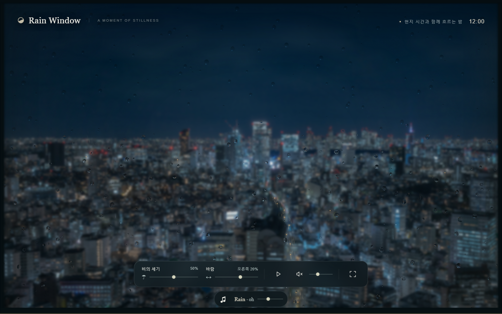 | 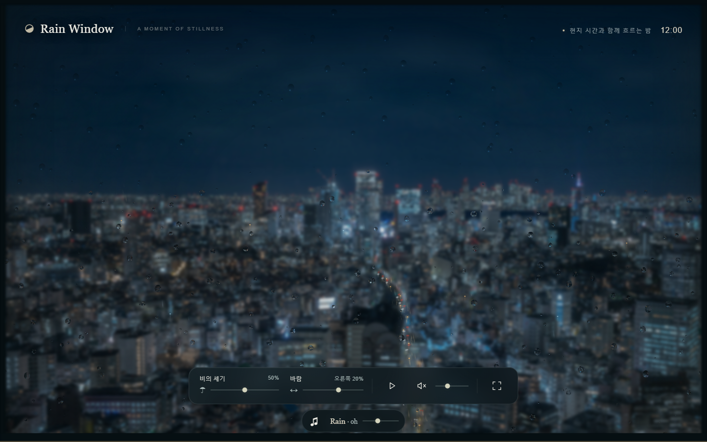 | 식별 가능한 부드러운 차량 광원 |
| 시간대 비교 | 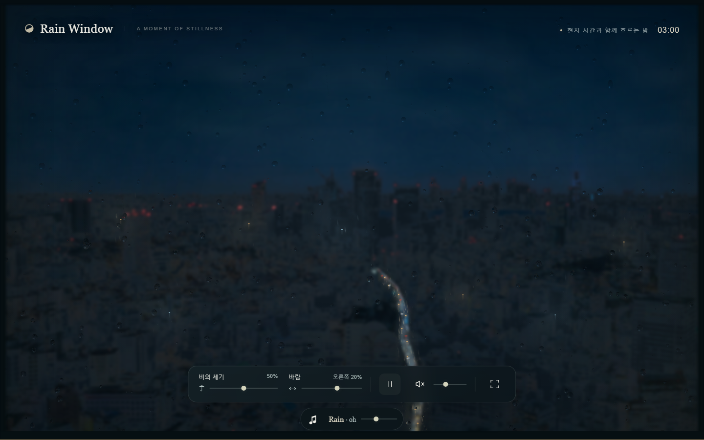 | 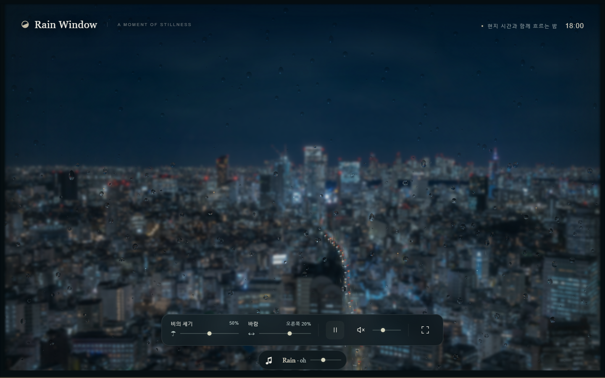 | 새벽에도 이동 유지, 퇴근 시간 차량 증가 |

[모바일 실제 화면](screenshots/traffic-density-mobile.png)

## Rain — oh 배경음악 · 2026-09-22

- 독립 악보·합성으로 74 BPM, 32마디, 103.784초의 로파이 곡 제작. Dbmaj9–Bbm9–Ebm9–Ab13과 Fm9·Gbmaj9·Bb7(b13), 새 멜로디·스윙 리듬·구간별 편성 사용. 원곡 음원·선율 채보·외부 샘플 없음. 생성 스크립트·시드·구조·출처를 저장소에 보존.
- 부드러운 전자피아노, 낮은 베이스, 약한 킥·브러시 스네어·하이햇, 스테레오 룸·딜레이. 소스 PCM의 RMS 0.105, peak 0.531; MP3 재디코딩 RMS 0.0997, peak 0.504, DC 절댓값 0.000001 이하, 반복 경계 점프 약 0.002. 파형 클리핑 없음. 전문 음악가의 마스터링·실제 스피커/이어폰 청취 평가는 수행하지 않음.
- 기본 꺼짐, 볼륨 40%. 사용자가 켤 때만 동일 출처 MP3를 가져오며 볼륨 변경만으로 활성화하지 않음. 음악용 AudioContext·버퍼·반복 소스 하나를 재사용. 소리 끄기·음량 0·감상 정지·숨김 탭에서 suspend하고 복귀 시 이어 재생. 페이지 해제 시 소스·다운로드 정리.
- 음악 다운로드·디코딩·재생 권한 오류는 음악만 끄고 재시도 안내. 기존 빗소리와 야경은 독립 유지. 모바일 음악 버튼·슬라이더 터치 높이 44px, 320×568·390×844·844×390에서 기존 조작부와 겹치지 않음.
- lint·typecheck·build, 단위 44개·브라우저 26개 통과. 실제 MP3 디코딩 길이·비영(非零) 에너지와 AudioContext running/suspended, 반복 켜기 시 소스 1개, 무음 초기 네트워크 요청 0건, 로딩 실패·재생 거부 후 복구, 탭 비활성 이벤트·정지·재개 검사. 모바일은 에뮬레이션이며 Safari·Firefox·실기기는 미검증.

| 대상 | 변경 전 | 변경 후 | 판단 포인트 |
| --- | --- | --- | --- |
| 데스크톱 1440×900 |  |  | 작은 음악 조작과 Rain · oh 표시 |
| 모바일 390×844 | 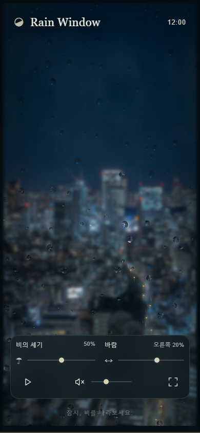 | 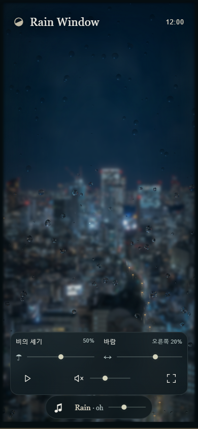 | 조작 간격과 터치 영역 |

전후 캡처: 현지 낮 12시·비 50%·바람 20%·reduced-motion 초기 정지. 변경 전은 직전 버전의 실제 캡처를 보존.

## 차량 불빛·강우에 따른 광학 표현 · 2026-09-22

- 선명한 크림색 사각 점과 큰 고정 광륜을 백색 헤드라이트·붉은 후미등의 부드러운 쌍으로 교체. 도로 방향을 따라 등 간격을 회전하고, 멀수록 간격·광량을 줄임. 기존 속도·경로·차량 수는 유지.
- 거리 d=450+도로 이동거리(m), 강우 r=0~1을 가정. 투과율 `exp(-(0.00012+0.00095*r^1.35)*d)`과 점광원의 거리 제곱 감쇠 적용. 번짐 폭을 늘릴 때 중심 밝기를 폭 제곱에 반비례하도록 보정하여 비가 강해져도 총광량이 증가하지 않음. [Beer–Lambert 원리](https://pbr-book.org/4ed/Volume_Scattering/Transmittance). 계수와 거리·화각은 장면용 가정이며 실제 강수량 환산이나 다중 산란 계산은 아님.
- 짧고 끊긴 젖은 노면 반사는 차량과 함께 이동하고 같은 감쇠를 적용. 유리 굴절에 쓰는 장면에도 동일 광원 표현 사용. 정지 상태에서 비 세기 변경 시 즉시 갱신.
- lint·typecheck·build, 단위 검사 41개 통과. 브라우저 전체 22개 중 기존 검사 1개가 옛 사각형 색상을 추적해 실패했고, 새 광원 좌표 추적으로 교정 후 해당 파일 2개 검사 통과(최종 모든 항목 통과). 실제 Canvas 픽셀에서 강우 0/50/100의 최대 밝기·적분 광량 감소, 번짐 분산 증가, 백색·적색 구분을 확인. 차량 이동·정지·재개, 새벽 조명·모바일 조작도 검사.
- 아래 전후는 실제 Chromium 화면, 낮 12시·비 50%·바람 20%·reduced-motion 초기 정지로 동일 조건. 모바일은 에뮬레이션이며 실제 휴대전화·Safari·Firefox는 미검증.

| 대상 | 변경 전 | 변경 후 | 판단 포인트 |
| --- | --- | --- | --- |
| 데스크톱 1440×900 | 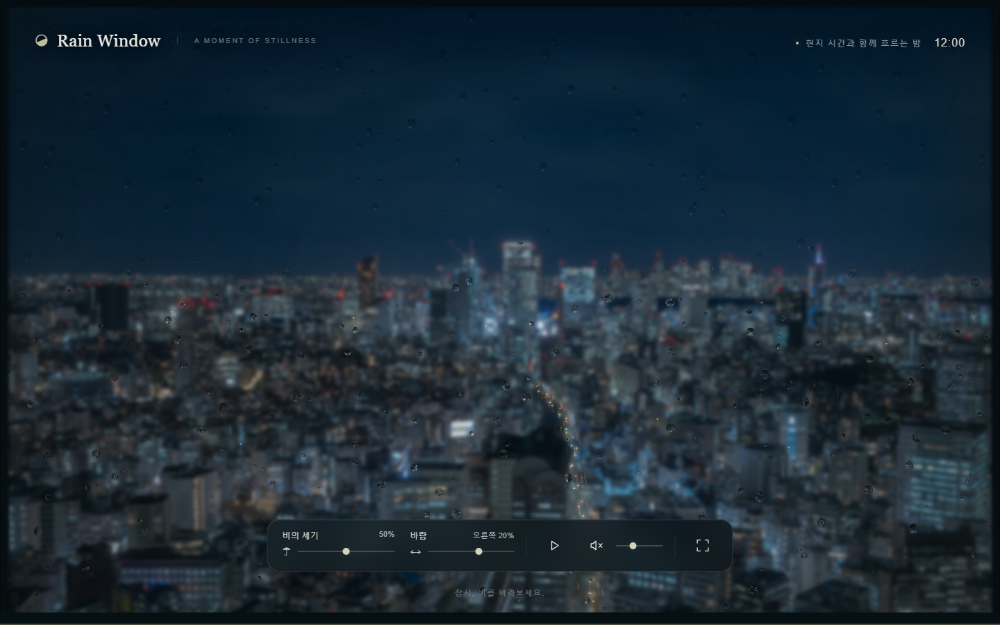 | 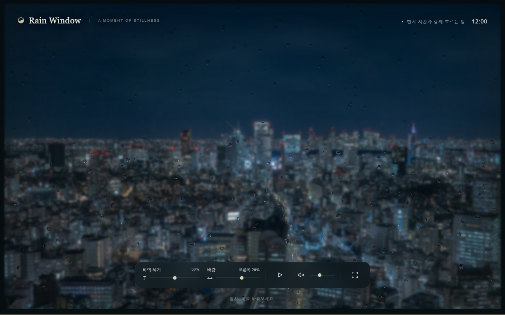 | 도로 위 날카로운 황색 점 제거와 은은한 광원 |
| 모바일 390×844 | 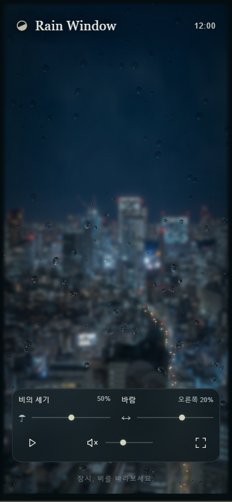 |  | 사진 배율에 맞는 불빛과 기존 조작 유지 |

강우 비교: [0%](screenshots/traffic-rain-0.png) · [50%](screenshots/traffic-rain-50.png) · [100%](screenshots/traffic-rain-100.png). 먼 차량은 강한 비에서 잘 보이지 않도록 의도했으며, 가로등·사진 자체의 고정 조명은 이번 차량 변경 대상이 아님.

## 차량 속도·원근 거리 계산 · 2026-09-22

- 이전에는 사진의 도로 구간을 균일한 비율로 이동하며 전체 통과 시간이 약 40~56초였음. 가시성 개선 때 올린 속도를 거리·시간 기반 계산으로 교체.
- 도로 1,200m, 양방향 18/21km/h를 장면용 가정으로 설정. 이동 거리는 `km/h ÷ 3.6 × 초`. 전체 통과 시간은 각각 240초/약 206초. 실제 사진의 축척·카메라 교정값·교통 속도를 확보한 것은 아님.
- 정규화한 소실선 y=0.36 아래 도로 점을 가상 평면으로 역투영하고 구간별 지면 거리를 누적. 거리로 보간한 뒤 다시 사진 좌표로 투영하여, 구간 길이·원근을 무시한 균등 진행을 제거. 동일 방향은 같은 속도를 사용해 임의의 추월·불빛 겹침을 줄이고 경로 양 끝 25m에서 밝기를 완화.
- 1440×900의 사진 높이 976 CSS px 기준, 시속 18km 차량이 경로 100m/600m/1000m 지점에서 1초간 이동하는 세로 거리는 약 3.46/1.33/0.78px. 실제 지리적 거리 측정값이 아닌 위 투영 가정의 계산 결과.
- lint·typecheck·build, 단위 검사 38개 통과. 속도 단위 변환·전체 통과 시간·순환 거리·가까운/먼 구간의 이동량을 검사. 관련 브라우저 검사 7개로 차량 움직임과 정지·재개, 도시 조명, 시계, WebGL 실패 처리를 재확인.
- [변경 후 실제 실행 영상](screenshots/rain-motion.webm) 갱신. [변경 전 영상](https://github.com/okorion/rain-window/blob/084d89793f752a7cd544b5f0e6c3198cd82ded69/docs/screenshots/rain-motion.webm)과 같은 1440×900·현지 낮 12시·기본 비·바람 조건이며 프레임 스케줄 차이는 있음. 모바일 실기기 검증과 신호등·정체 시뮬레이션은 범위 밖.

## 도시 조명·차량 가시성·빛에 비치는 비·음향·시계 · 2026-09-22

- 공개 사이트의 차량 그리기 좌표를 직접 추적: 약 3.45초에 8.54px 이동. 애니메이션 정지가 아니라 작은 불빛·느린 속도·도시 전체 블러가 가시성을 낮추는 상태였음. 사진 속 도로에 경로를 보정하고 속도·광원 크기를 조절, 차량·가로등은 도시 블러 뒤에 별도로 합성. Sites에서 정상 작동하므로 Vercel로 이전하지 않음.
- 가로등 15개와 생활 조명 7개, 작은 젖은 도로 반사 추가. 새벽에는 사무실 소등을 유지하며 가로등과 생활 조명·차량은 유지. 어두운 건물 표면의 기본 밝기를 소폭 보강.
- 균일한 하늘의 빗줄기와 전체 안개를 제거. 광원 범위에서만 끝이 부드럽게 사라지는 짧은 비와 국소 안개를 표시. 같은 광원 위치·색상으로 비를 비추며 제한된 방울 예산을 보이는 영역에 집중.
- 합성 음향을 24초 스테레오 루프로 교체. 고주파·출력 크기를 줄이고 완만한 배경 변화와 불규칙한 부드러운 타격음을 혼합. 단일 AudioContext·반복 소스, 사용자 직접 재생, 실패 처리 유지. 외부 음원·의존성 추가 없음.
- 현지 시각 HH:mm 시계 추가. 감상 정지 중에도 갱신하며 숨김 탭·pagehide에는 타이머 중단, 복귀 시 현재 시각 복원. 작은 화면에서 제목과 겹치지 않도록 배치.
- lint·typecheck·build, 단위 검사 36개 및 전체 브라우저 검사 20개 통과. 추가 검사는 광원 밖 투명도·감쇠, 음향 DC·클리핑·고주파 에너지·루프 경계·좌우 차이, 실제 차량 이동·정지·재개, 새벽 조명과 모바일 시계·정지 중 분 전환을 확인.

| 대상 | 변경 전 | 변경 후 | 판단 포인트 |
| --- | --- | --- | --- |
| 데스크톱 1440×900 | 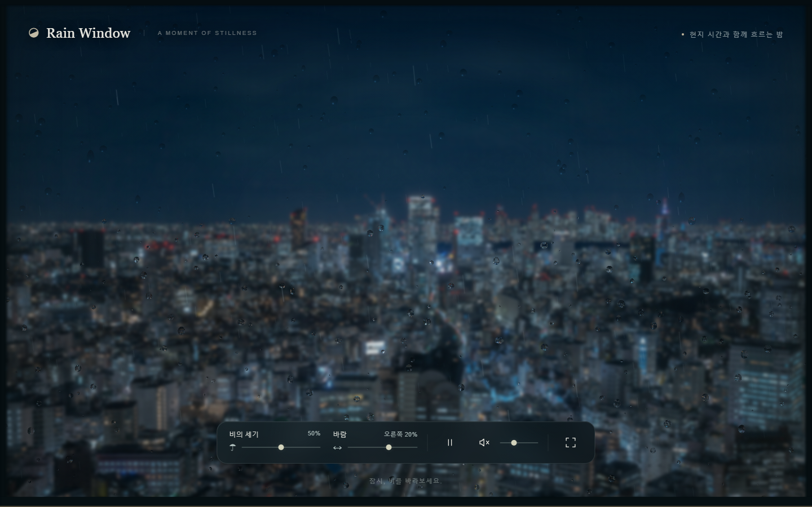 | 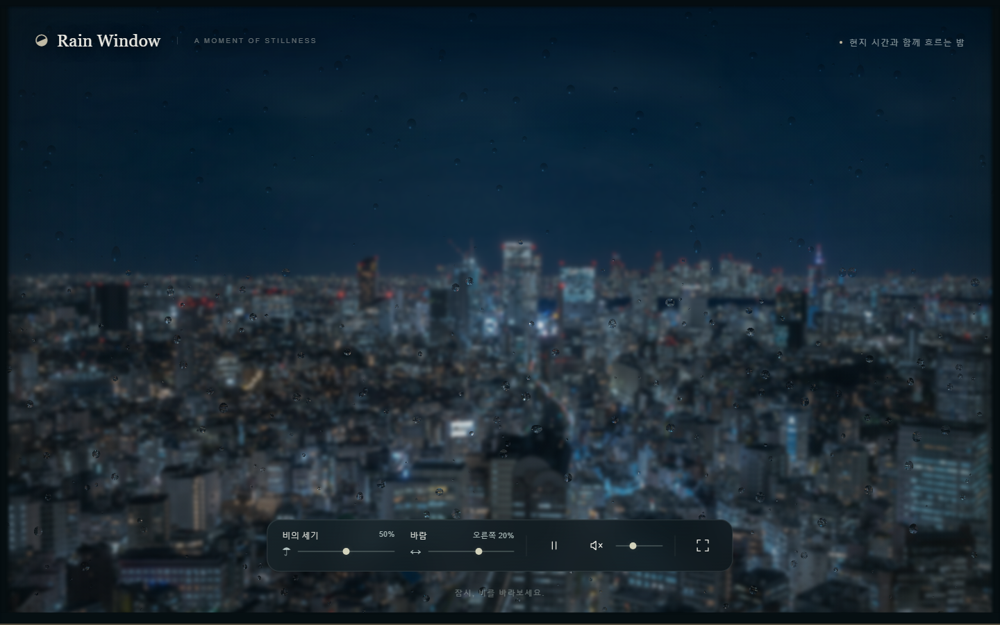 | 시계, 도로 광원, 어두운 하늘의 균일한 선 제거 |
| 모바일 390×844 | 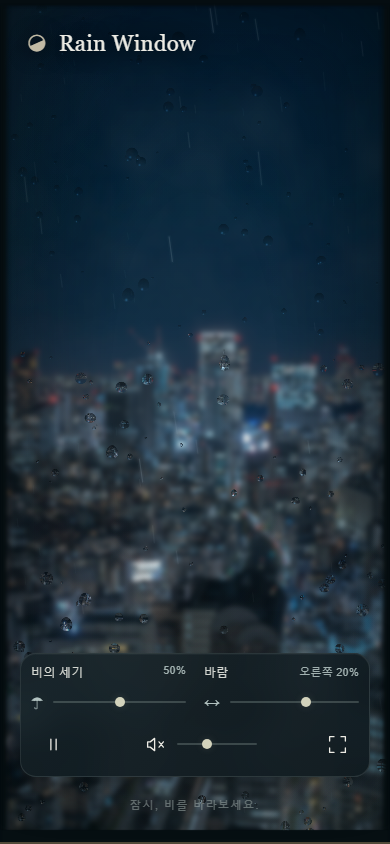 | 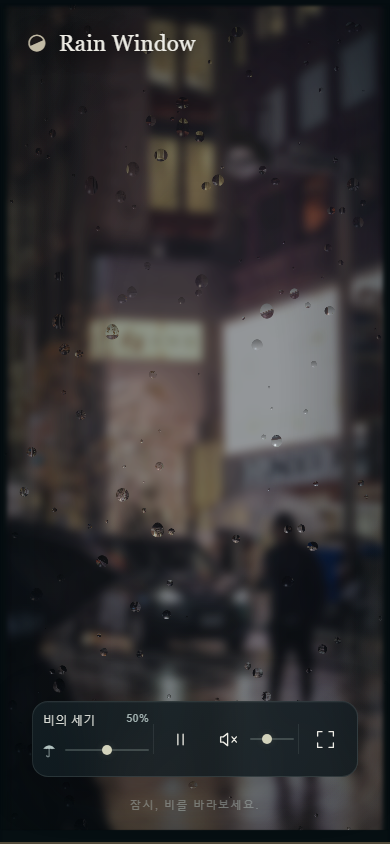 | 시계와 제목 간격, 조명 주변 비 |
| 새벽 03시 | — | 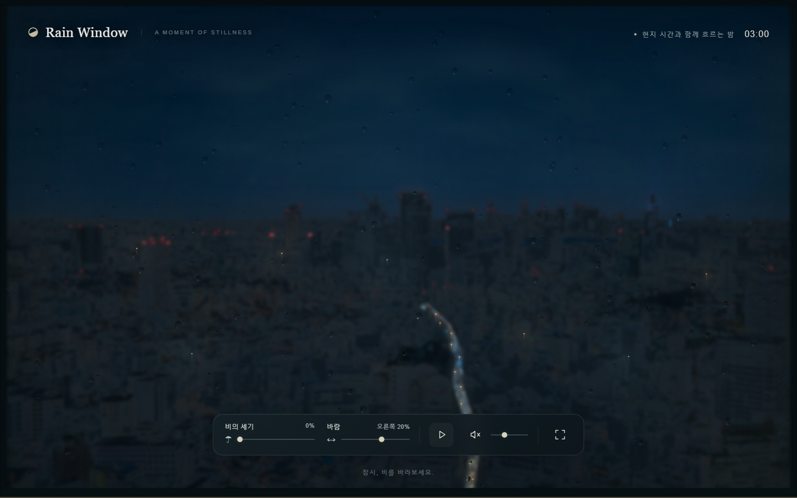 | 사무실은 소등하고 가로등·생활 조명 유지 |

전후는 기본 비 50%·오른쪽 바람 20%·현지 낮 12시로 캡처. 새벽 캡처는 비 0·일시정지 상태로 조명 확인. 프레임 시각에는 스케줄러 차이가 있다. 실제 비 촬영·광학 시뮬레이션이 아닌 합성이며 모바일은 에뮬레이션, 실기기·Safari·Firefox·스피커별 청취 품질은 미검증.

## 창밖 원거리 비 · 2026-09-22

- 도시와 유리 사이에 세 깊이의 빗줄기와 옅은 빗안개 추가. 길이·속도·두께·밝기 차이로 거리를 표현하고 바람 양방향·무풍에 반응. 같은 비를 굴절용 장면에도 합성.
- 비 강도 0에서는 창밖 비·빗안개 제거, 기존 유리 방울 유지. 일시정지·reduced-motion·비활성 탭은 기존 단일 렌더 루프를 함께 정지. 사진 실패 시 기본 야경에서도 동작.
- 추가 외부 자산·의존성 없음. 창밖 빗줄기 최대 420개(모바일)/900개(데스크톱), 도시 합성의 기존 15/20fps와 픽셀 예산 유지.
- lint·typecheck·build 및 단위 검사 33개·브라우저 검사 18개 통과. 추가 검사는 밀도 상한, 바람 방향, 시간 도약 방지, 120초 후 화면 범위 유지, 사진 성공/실패에서 강도 0↔100·정지·재개를 확인.
- 실제 데스크톱·모바일 화면과 [실행 영상](screenshots/rain-motion.webm) 갱신. 아래 캡처는 동일 뷰포트·비 50%·오른쪽 바람 20%·현지 낮 12시 상태. 실제 프레임 시각에는 스케줄러 오차가 있음.

| 대상 | 변경 전 | 변경 후 | 판단 포인트 |
| --- | --- | --- | --- |
| 데스크톱 1440×900 |  |  | 도시 앞에 내리는 가는 비, 유리 방울과 초점 차이 |
| 모바일 390×844 | 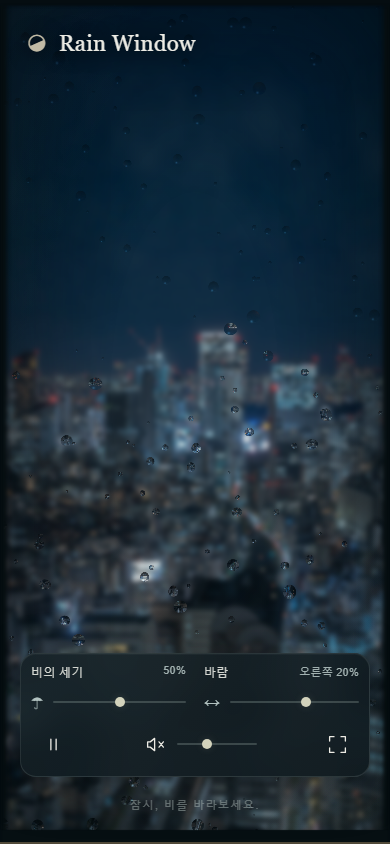 |  | 세로 화면의 비 밀도와 컨트롤 가독성 |

실제 비 영상이 아닌 합성 효과이며 건물별 비의 가림·조명 산란은 물리적으로 계산하지 않는다. 모바일은 Chromium 에뮬레이션이며 실기기·Safari·Firefox·장시간 열/배터리 성능은 미검증.

## 바람·살아 움직이는 도시·현지 시간 조명 · 2026-09-21

- 바람 슬라이더 −100~100(왼쪽·무풍·오른쪽) 추가. 이동 방울·충격 미세 튀김과 구름의 횡이동에 적용. 모바일은 날씨 조절과 재생·음향 버튼을 두 줄로 배치.
- 캐시한 구름 질감 두 층, 사진 속 도로 경로를 따르는 차량 불빛 22개, 실제 창문 픽셀 영역의 느린 점등·소등 추가. 도시가 변하면 물방울 굴절용 배경도 갱신.
- 기기 현지 시각 08–22시 일반 야경, 22–01시 점진적 소등, 01–05시 사무실 소등, 05–08시 재점등. 도로·차량과 붉은 안전등 유지. 하늘과 건물의 경계는 색상·높이로 근사하며 실제 도시 조명 데이터를 사용하지 않음.
- 일시정지·reduced-motion·숨김 상태에서는 전체 장면 중단, 복귀 때 현재 시각 재평가. 비 강도 0은 비만 멈추며 도시와 물방울 내부의 반사는 계속 변화.
- lint·typecheck·build, 단위 테스트 29개와 브라우저 테스트 16개 통과. 추가 검사는 조명 시간 경계·자정 연속성, 바람 양방향·무풍, 320px 컨트롤, 도시 정지·재개 및 현지 시각 12시→03시→06:30→12시 전환과 화면 밝기 차이를 확인.
- 아래 최신 캡처는 기본 비 50%·바람 오른쪽 20%, 낮 12시를 고정해 일반 야경 상태로 기록. 모바일은 에뮬레이션이며 실기기·Safari·Firefox는 미검증.

| 대상 | 변경 전 | 변경 후 | 판단 포인트 |
| --- | --- | --- | --- |
| 데스크톱 1440×900 | 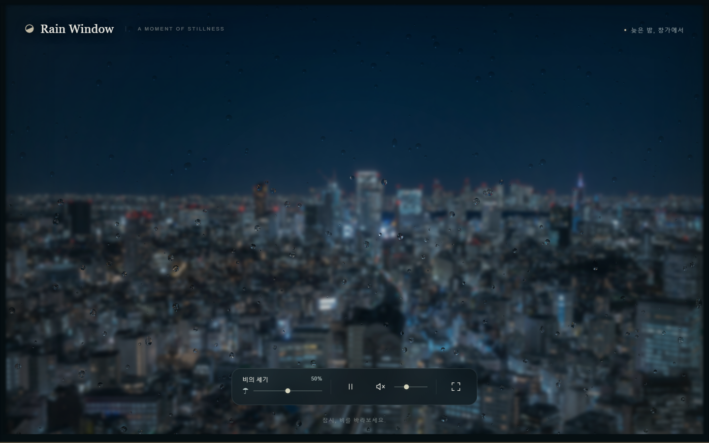 |  | 바람 조절·구름·차량·창문 변화 |
| 모바일 390×844 | 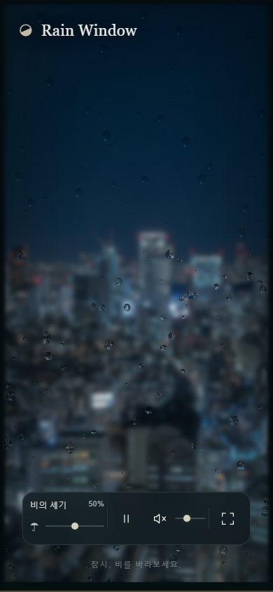 |  | 두 줄 컨트롤과 터치 영역 |
| 시간별 조명 |  | 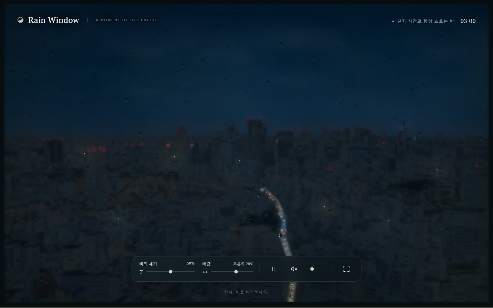 | 하늘·도로를 유지하며 사무실 소등 |

도시 합성은 데스크톱 최대 20fps·모바일 최대 15fps, 빗물은 기존 60/30fps 상한. 실제 스케줄의 하루 전체를 기다린 검사가 아닌 브라우저 현지 시각을 고정·전환한 검증이다.

## 유리 충격과 고층 야경 · 2026-09-21

- 유리에 빗물이 도착하는 불규칙한 충격 추가. 약 45ms 동안 납작하게 퍼졌다가 약 0.48초 안에 수축·정착하며, 주변에 2~4개의 작은 물방울이 짧게 튀고 사라짐. 큰 동심원이나 화면 전체 번쩍임은 사용하지 않음.
- 충격 도착률은 비 강도·화면 면적에 따라 조절. 기존 정지 방울 슬롯을 재사용하고 동시 충격 32개·GPU 배치 5,800개 상한. 비 0·일시정지·비활성 탭에서는 생성·진행 중단.
- 도쿄 에비스의 실제 고층 야경으로 배경 교체. 가까운 옥상·먼 스카이라인 구도, 배경 블러 3.2px·굴절용 0.6px. 약 20층 창가 분위기를 위한 선택이나 사진의 정확한 촬영 층수는 미확인이고 시각상 더 높을 수 있음.
- lint·typecheck·build, 단위 검사 17개와 브라우저 검사 14개 통과. 추가 단위 검사는 30/60/120Hz 도착 수 일치, 모바일 밀도, 비 0·시간 정지, 120초간 충격 상한과 수축 종료의 연속성을 검사.
- 실제 데스크톱·모바일 캡처 및 [실행 영상](screenshots/rain-motion.webm) 갱신. 모바일은 에뮬레이션이며 실기기 검증은 아님.

| 대상 | 변경 전 | 변경 후 | 판단 포인트 |
| --- | --- | --- | --- |
| 데스크톱 1440×900 | 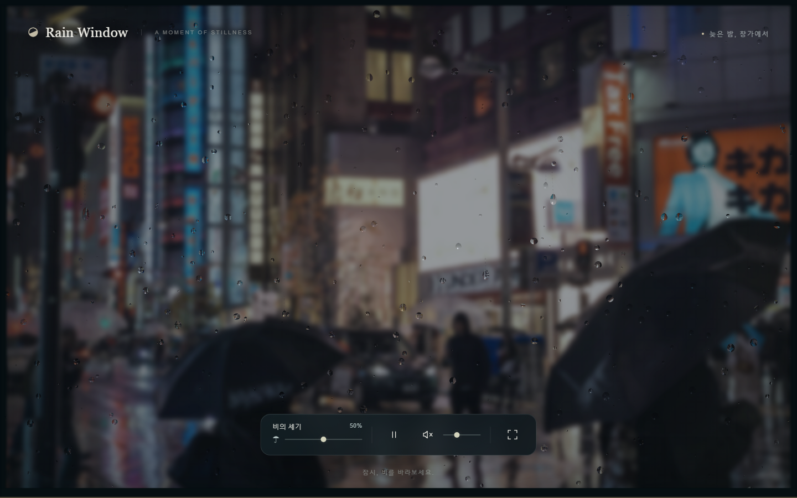 |  | 고층 야경 구도와 짧게 퍼지는 충격 |
| 모바일 390×844 |  |  | 세로 구도·새 물방울·조작 유지 |

사진 출처·라이선스·촬영 높이의 한계는 [자산 상세](../public/images/ATTRIBUTION.md)에 기록. 이전 사진 원본은 배포 자산에서 제거했고, 비교 캡처에 대한 출처는 보존.

## 곡면 굴절과 자연스러운 흐름 · 2026-09-21

- 고정 테두리·밝은 선으로 된 꼬리를 제거하고 WebGL 곡면 굴절·도시 조명 기반 반사로 교체. 곡면을 픽셀별로 계산해 작은 방울의 계단 현상을 줄임.
- 배경 블러 5px, 굴절용 사진 블러 0.6px를 따로 캐시. 큰 방울은 표면에 머물다가 가속하며 속도에 따라 길어지고, 주변의 작은 방울을 제한적으로 흡수. 정지 방울 재생성은 정지 방울로 유지해 시간이 흐를수록 이동 방울 비율이 증가하지 않도록 처리.
- 물길은 흰 선 대신 0.35~1.15초간 잔여 물막 조각으로 표시. 주 방울 상한 240/560개, 잔여 조각 상한 2,200/5,000개, GPU 배치 상한 5,600개. 픽셀·프레임 예산 유지.
- lint·typecheck·build, 단위 검사 12개와 브라우저 검사 14개 통과. WebGL 미지원, 실제 `WEBGL_lose_context` 확장으로 GPU context 상실, 시각 프레임 변경·비 0에서 불변·일시정지·재개 추가 검사.
- [실제 브라우저 실행 영상](screenshots/rain-motion.webm): 1440×900, 기본 비 → 0 → 100 → 일시정지 → 재개. 영상은 결과물 캡처이며 배경 영상 자산으로 사용하지 않음.
- 아래 화면은 같은 뷰포트·비 50%·무음 조건. 데스크톱은 3.5초, 모바일은 크기 변경 후 0.5초에 캡처하며 프레임 스케줄러 오차가 있음.

| 대상 | 변경 전 | 변경 후 | 판단 포인트 |
| --- | --- | --- | --- |
| 데스크톱 1440×900 |  |  | 고정 흰 윤곽·긴 선 제거, 주변 도시의 곡면 굴절 |
| 모바일 390×844 | 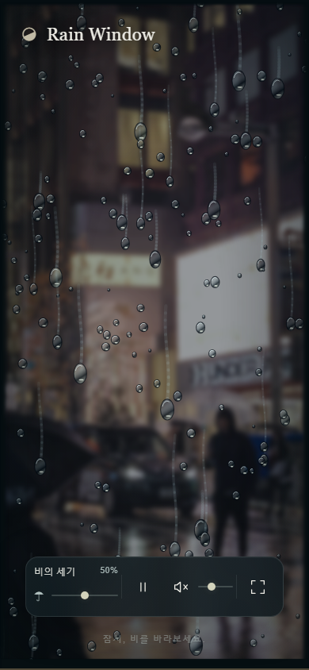 |  | 유리와 배경의 초점 차이, 터치 조작과 가독성 |

한계: 실사 빗물 동영상 자체가 아니며 정적인 도시 사진 위 실시간 근사 효과다. 모바일은 에뮬레이션이며 실제 휴대전화·Safari·Firefox·장시간 열/배터리 성능은 미검증. GPU 사용이 차단되거나 context를 잃으면 기존 정적 CSS 대체 화면으로 전환한다.

## 실제 도시 배경·물방울 가시성 개선 · 2026-09-21

- 기본 밀도: 데스크톱 205→406개, 모바일 90→174개. 상한은 각각 560개·240개이며 픽셀 예산과 프레임 상한은 유지.
- 정지 방울 반경 1.4~6px, 움직이는 방울 반경 4.5~8.5px. 어두운 윤곽·밝은 반사와 초기 물길을 추가해 밝고 어두운 배경에서 구분.
- 실제 도쿄 야경 사진을 같은 출처에서 제공. 사진 로드·크기 변경 때만 중앙 자르기와 블러 적용. 사진 실패 시 절차적 야경과 비 조작 유지.
- lint·typecheck·build, 단위 검사 12개, 기존 브라우저 검사 9개와 추가 검사 2개 통과. 추가 검사는 기본 물방울의 가시 면적과 사진 로드 실패를 검사.
- 아래 전후 화면은 같은 뷰포트·기본 비 강도 50%·무음 조건에서 브라우저로 캡처. 데스크톱은 접속 후 3.5초, 모바일은 화면 변경 후 0.5초이며 실제 프레임 시각에는 스케줄러 오차가 있음.

| 대상 | 변경 전 | 변경 후 | 판단 포인트 |
| --- | --- | --- | --- |
| 데스크톱 1440×900 | 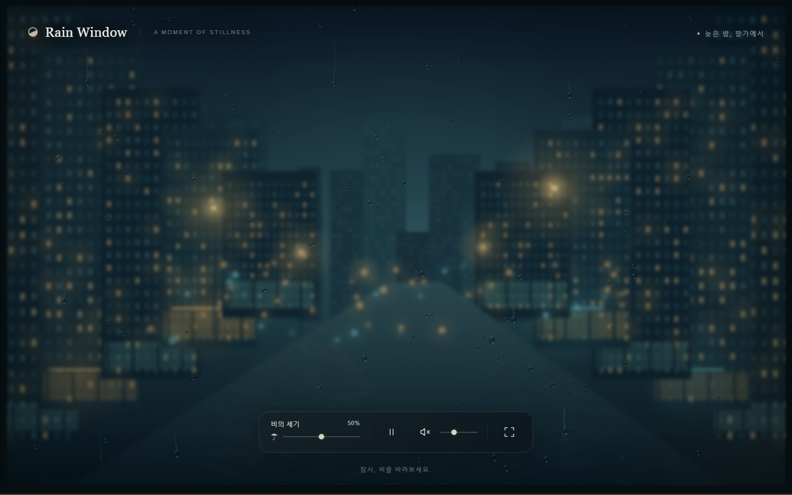 |  | 실제 사진, 물방울 크기·윤곽·밀도 |
| 모바일 390×844 | 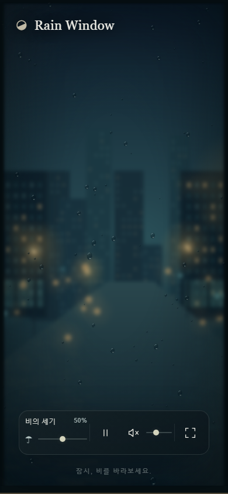 |  | 세로 자르기, 물길과 컨트롤 가독성 |

사진 출처와 이용 조건: [Charmaine / Pexels](../public/images/ATTRIBUTION.md). 실기기·Safari·Firefox와 사진 속 움직임은 검증·구현 범위 밖이며, 배경은 정적인 사진이다.

## 첫 공개 버전 · 2026-09-21

- `npm run lint`, `npm run typecheck`, `npm test`(12개), `npm run build` 통과.
- 배포용 `dist`를 Vite preview로 서비스하여 Playwright Chromium 검사 9개 통과.
- 비 강도 0/50/100, 음량 0/70, 음소거, 반복 재생, 단일 AudioContext·소스 유지, 일시정지 후 Canvas 불변과 재개, 전체 화면 진입·종료 확인.
- 390×844, 320×568, 844×390 뷰포트와 렌더 픽셀 예산 확인. 실제 휴대전화 검증은 하지 않음.
- reduced-motion, visibilitychange 이벤트 주입, 오디오 재생 거부, Canvas 초기화 실패·context 상실, 전체 화면 미지원·거부 확인. visibilitychange는 자동화로 상태를 주입한 검사이며 실제 OS의 탭 전환과 구분함.
- `agent-browser`로 실제 페이지 로드·컨트롤 접근성 트리·일시정지→재생 전환을 별도 확인.
- 실제 실행 화면: `screenshots/desktop.png`(1440×900), `screenshots/mobile.png`(390×844). 생성 목업이 아님.

초기에는 개별 창문마다 적용한 Canvas blur로 데스크톱 headless 렌더가 30초 제한을 넘었습니다. 완성된 배경에 한 번만 적용하도록 수정한 뒤 전체 브라우저 검사가 약 11초에 통과했습니다. 테스트 선택자의 `status` 중복은 안내 영역으로 명확히 좁혀 해결했습니다.

단위 테스트는 프레임 시간 도약 방지, 방울 수·픽셀 예산 제한, 음향 상태 전환과 비동기 재생 완료 경쟁을 검사합니다. 실제 스피커 청취 품질, Safari·Firefox, 장시간 실기기 성능은 미검증입니다. 물방울은 근사 굴절이며 충돌·합쳐짐은 구현하지 않았습니다.
